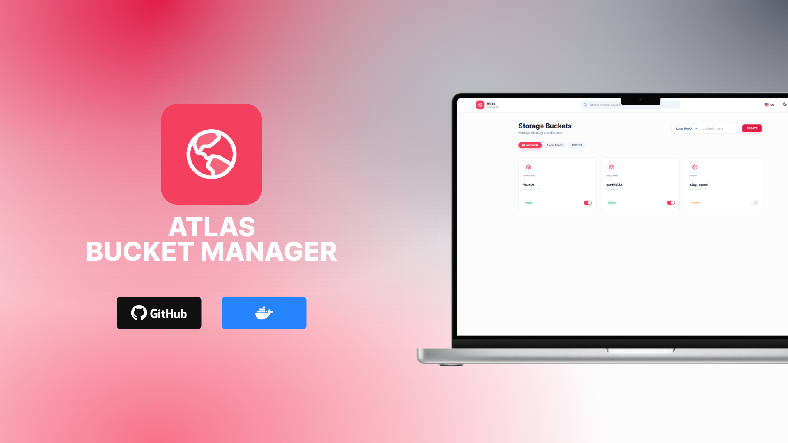

# 🪣 Atlas Bucket Manager

> A high-performance, unified Multi-Cloud UI for managing S3-compatible storage (MinIO, AWS S3, R2, Spaces). Built with **Lit Web Components** and **Tailwind CSS** for blazing-fast performance and modern user experience.



Atlas is a lightweight, secure, and modern web interface designed to bridge the gap between local development and cloud production. Manage visibility, explore files, and perform global searches across all your storage providers in one unified place.

**Tech Stack**: Lit v3.2.1 (Web Components) • Express.js • TypeScript • Tailwind CSS (~15KB) • WCAG 2.1 AA Accessibility

---

## ✨ Multi-Cloud Features

- **🌐 Unified Dashboard**: View buckets from MinIO and AWS S3 in a single view with provider-specific badges.
- **🔍 Global Search**: Search for any file across **all buckets and all providers** at the same time (includes mobile fullscreen mode).
- **🛡️ Secure Preview Tunnel**: Preview private images, videos, audio (with integrated player), and PDFs through an internal proxy. No need to expose ports or deal with CORS.
- **📤 Bulk Operations**: Support for multi-file upload and bulk deletion with checkbox selection.
- **🔗 Smart Share Links**: Generate temporary download links with custom expiration (1min to 7 days).
- **📊 Storage Stats**: Instant calculation of total size and object count per bucket.
- **🪣 Copy Bucket Engine**: Complete bucket backup between providers with real-time progress tracking via WebSocket. Features include:
  - Stream-based copying (memory efficient)
  - Progress tracking: files copied, bytes transferred, speed (MB/s), and ETA
  - Automatic folder creation and recursive copying
  - Skip existing / Overwrite options
  - Cancel running jobs
  - Auto-refresh bucket list after completion
- **🗑️ Safe Deletion**: Delete buckets with automatic content cleanup. Requires typing the bucket name to confirm, preventing accidental deletions.
- **🌍 Internationalization (i18n)**: Full support for 6 languages (EN, ES, PT, FR, JA, ZH) with persistent preference. Translation files are externalized for easy maintenance (`public/js/i18n/`).
- **🎨 Modern UI Components**:
  - Copy Bucket Modal: Search/filter existing buckets or create new ones
  - Copy Progress Panel: Floating real-time progress with WebSocket updates
  - Delete Confirmation Modal: Type bucket name to confirm
- **🌍 Multi-language**: 🇺🇸 EN, 🇪🇸 ES, 🇧🇷 PT, 🇫🇷 FR, 🇯🇵 JP, 🇨🇳 ZH (persistent preference).
- **🌗 Modern UI**: Fully persistent Dark/Light mode, mobile-responsive design, and WCAG 2.1 AA accessibility.
- **⚡ Lightweight**: Only ~15KB minified CSS (99.5% smaller than CDN), 11 reusable Lit web components.
- **♿ Accessible**: 25+ ARIA labels, keyboard navigation, screen reader support.

---

## 🔌 Supported Providers

### Available Now (v0.0.9) ✅

- **MinIO** (Amazon S3 compatible)
- **AWS S3** (Amazon Web Services)
- **Cloudflare R2**
- **DigitalOcean Spaces**
- **Wasabi Hot Cloud Storage**
- **Any S3-Compatible API**

### Coming Soon (Roadmap) 🚀

- **Google Cloud Storage (GCS)**
- **Azure Blob Storage**
- **Backblaze B2**
- **Oracle Cloud Storage**

---

## 🚀 Quick Start (Production)

### 1. Create a `docker-compose.yml`

```yaml
version: "3.8"

services:
  atlas-manager:
    image: ghcr.io/ameth1208/atlas-bucket-manager:latest
    container_name: atlas-manager
    ports:
      - "3000:3000"
    env_file:
      - .env
    restart: always
```

### 2. Configure Credentials (`.env`)

```bash
# App Credentials
ADMIN_USER=admin
ADMIN_PASS=password

# Provider 1: MinIO
MINIO_ENDPOINT=minio.example.com
MINIO_PORT=9000
MINIO_ACCESS_KEY=your_key
MINIO_SECRET_KEY=your_secret

# Provider 2: AWS S3 (Optional)
AWS_ACCESS_KEY_ID=your_aws_key
AWS_SECRET_ACCESS_KEY=your_aws_secret
AWS_REGION=us-east-1
```

### 3. Run

```bash
docker-compose up -d
```

Visit `http://localhost:3000`. 🎉

---

## ☕ Support

If you find this project useful, consider buying me a coffee!

[](https://www.buymeacoffee.com/amethgmc)

---

## 🛠️ Development

1.  **Clone:** `git clone https://github.com/ameth1208/atlas-bucket-manager.git`
2.  **Install:** `npm install`
3.  **Build CSS:** `npm run build:css` (production) or `npm run build:css:watch` (development)
4.  **Build & Run:** `npm run build && npm start` (or `npm run dev` for hot reload)

---

&copy; 2026 [Ameth Galarcio](https://amethgm.com). Open Source under MIT License.
